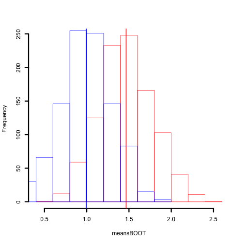
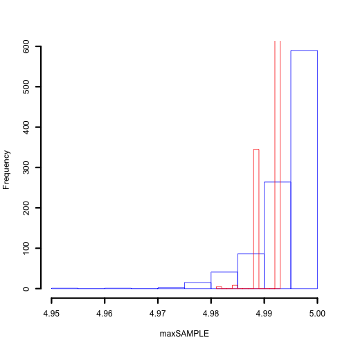

Borrelli Week 1 Notes
========================================================  


```r
opts_chunk$set(comment = NA)
```


Exercise 1 - Normal
--------------------------------------------------------  

Drawing 1000 samples of 100 randomly drawn values from a normal

```r
samples <- matrix(nrow = 1000, ncol = 100)
for (i in 1:1000) {
    samples[i, ] <- rnorm(100, 1, 3)
}

meansSAMPLE <- rowMeans(samples)
```

  
Bootstrapping 

```r
norm1 <- rnorm(100, 1, 3)
boot <- matrix(nrow = 1000, ncol = 100)
for (i in 1:1000) {
    boot[i, ] <- sample(norm1, 100, replace = T)
}

meansBOOT <- rowMeans(boot)
```


Plot the histograms

```r
hist(meansBOOT, border = "red")
abline(v = mean(meansBOOT), col = "red", lwd = 2)
hist(meansSAMPLE, border = "blue", add = T)
abline(v = mean(meansSAMPLE), col = "blue", lwd = 2)
```

 

  

Exercise 2 - Uniform
--------------------------------------------------------    
Drawing 1000 samples of 100 randomly drawn values from a normal

```r
samples2 <- matrix(nrow = 1000, ncol = 1000)
for (i in 1:1000) {
    samples2[i, ] <- runif(1000, 0, 5)
}

maxSAMPLE <- apply(samples2, 1, max)
```

  
Bootstrapping 

```r
unifsampl <- runif(1000, 0, 5)
boot2 <- matrix(nrow = 1000, ncol = 1000)
for (i in 1:1000) {
    boot2[i, ] <- sample(unifsampl, 1000, replace = T)
}

maxBOOT <- apply(boot2, 1, max)
```


Plot the histograms

```r
hist(maxSAMPLE, border = "blue")
hist(maxBOOT, border = "red", add = T)
```

 

